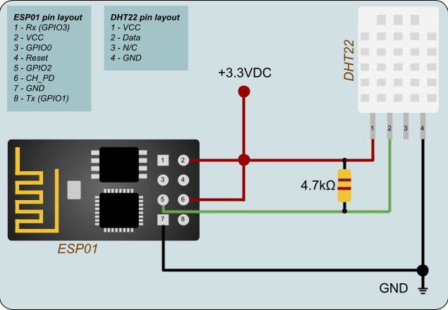

# SuperDuperWeatherStation #

This is a small weather station project which measures the environment temperature and humidity then sends this data to a dedicated server and the data is accessible from a web browser. Currently, it was developed on Windows 11, probably works on Ubuntu too.

## Environment ##

The weather station consists of two components:

### Client (measuring station) ###

The client is where the actual measuring will take in place. The client hardware components consists of the following:
- ESP01 - microcontroller with a built-in Wi-Fi module
- DHT22 - temperature and humidity sensor

### Server ###

The acquired data will be stored on the server in a MongoDB database and is accessible from a web browser or basically anything that allows to make HTTP requests (i.e. curl, Postman etc.). The server consists of the following:
- Golang 1.20
- MongoDB

The server components are wrapped in Docker files which allows to instantly build and run the server and database quickly. Make sure the Docker environment is properly installed in your machine.

## Setup ##

### Client ###
0. Make sure the [Arduino IDE](https://www.arduino.cc/en/software) is installed with the accompanying [ESP8266 package](https://randomnerdtutorials.com/how-to-install-esp8266-board-arduino-ide/)
1. Connect the ESP01 module to your PC and make sure that the module is set in flashing/programming mode 
2. Select the `Port` and `Board` (label: `Generic ESP8266 board`) inside the IDE (located under tools)
3. Compile (and upload) the code

Currently, there are environment variables located in the `.ino` file which need to be changed for your case, and those variables are:
- `SSID` - WiFi network name
- `PASSWORD` - WiFi network password
- `URL` - server URL

Example:
```cpp
#define SSID     "MyWifi";
#define PASSWORD "Password1234";
#define URL      "http://192.168.1.1:3500/ping" 
```
Assuming that the server is added to your local network, make sure to obtain the correct IP address from your router.

### Server ###

Navigate your terminal to the root of the project and execute the following command:
```shell
docker-compose up -d --build
```

Also, make sure that you enabled communication on port `3500` in your firewall so the data can be received by the server. 

## Schematic ##



## Smoke test ##

After the weather station is wired as shown in the schematic, turn on the power supply and the ESP01 should begin the initialization process by connecting to the provided Wi-Fi data and send the an initial `ping` request to the server. 

Make sure you follow the log output of the server by executing the following command:
```shell
docker logs sdws_server --follow
```
You should see all the activities on the server.